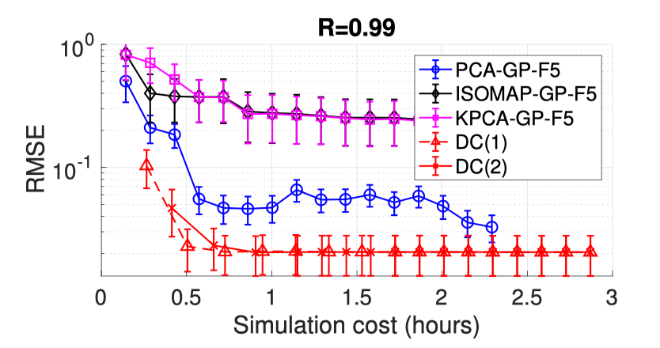

# DC
MATLAB code for the paper, Deep coregionalization (DC) for the emulation of simulation-based spatial-temporal fields (https://www.sciencedirect.com/science/article/pii/S0021999120307580).

Essentially, the method is a combination of residual principal component analysis (rPCA) and Nonlinear autoregression (NAR) for multi-fidelity spatial-temporal field emulations.

Please refer Demo_dc.m for the usage of the code. Please add all subfolder to your matlab path to start using the code.

---
The following are figures are taken from the paper.

*MAE field for Poisson’s equation (top row), heat equation (middle row) and Burger’s equation (bottom row). Deep coregionalization uses 256 Fidelity-1 and 32 Fidelity-2 samples, whereas the other methods use 256 Fidelity-2 samples; the low rank is fixed at R = 8. The error fields show similar patterns for the same PDE. The superiority of deep coregionalization is clearly revealed by its error scale with 8 times fewer Fidelity-2 samples.*

*RMSE as a function of the computational cost of generating the training data for the Navier-Stokes (NS) spatial-temporal simulation.*

---
Please cite the paper if you find this code useful.

@article{XING2021109984,
title = {Deep coregionalization for the emulation of simulation-based spatial-temporal fields},
journal = {Journal of Computational Physics},
volume = {428},
pages = {109984},
year = {2021},
issn = {0021-9991},
doi = {https://doi.org/10.1016/j.jcp.2020.109984},
url = {https://www.sciencedirect.com/science/article/pii/S0021999120307580},
author = {Wei W. Xing and Robert M. Kirby and Shandian Zhe},
keywords = {Surrogate model, Gaussian process, Emulation, Spatial-temporal field, Multifidelity model}}

